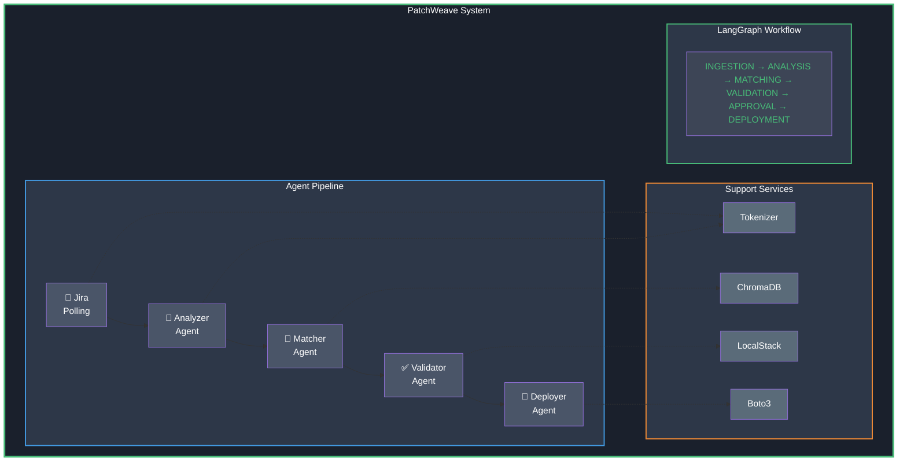

# PatchWeave

  <b>🔐 Intelligent Cloud Security Remediation System</b>

  
  
  
  

---

PatchWeave is a production-grade security remediation system that automatically analyzes cloud security findings, matches them to remediation playbooks, and deploys fixes with human approval.

## 🎯 Key Features

- **Automated Analysis**: LLM-powered analysis of security findings from Jira
- **Semantic Matching**: ChromaDB-based playbook matching with three-tier confidence scoring
- **Safe Deployment**: Validation against LocalStack before production deployment
- **Human-in-the-Loop**: Approval workflow with detailed Jira comments
- **Learning Loop**: System learns from successful remediations

## 🏗️ Architecture

## 📦 Quick Start

### Prerequisites

- Python 3.11+
- Docker and Docker Compose
- Terraform 1.0+
- AWS CLI
- Jira Cloud account with API token
- Google Gemini API key (free tier available)

### One-Command Setup

\`\`\`bash
# Clone the repository
git clone https://github.com/yourorg/patchweave.git
cd patchweave

# Run the setup script (does everything!)
./scripts/setup.sh
\`\`\`

The setup script will:
1. ✅ Check all prerequisites
2. ✅ Create Python virtual environment  
3. ✅ Install all dependencies
4. ✅ Create `.env` from template
5. ✅ Start LocalStack (TEST + PROD) and ChromaDB
6. ✅ Verify all services are healthy

### Manual Installation

\`\`\`bash
# Clone the repository
git clone https://github.com/yourorg/patchweave.git
cd patchweave

# Create virtual environment
python -m venv .venv
source .venv/bin/activate  # On Windows: .venv\Scripts\activate

# Install dependencies
pip install -e .

# Copy environment template and configure
cp .env.example .env
# Edit .env with your Jira and Gemini credentials

# Start infrastructure services
make docker-up

# Verify services
make docker-health

# Run the application
python -m patchweave
\`\`\`

### Required Credentials in .env

| Variable | Description | How to Get |
|----------|-------------|------------|
| `JIRA_BASE_URL` | Your Jira URL | `https://yourcompany.atlassian.net/` |
| `JIRA_EMAIL` | Your Jira email | Your login email |
| `JIRA_API_TOKEN` | Jira API token | [Create here](https://id.atlassian.com/manage-profile/security/api-tokens) |
| `JIRA_PROJECT_KEY` | Project key | e.g., `SEC`, `KAN` |
| `GOOGLE_API_KEY` | Gemini API key | [Get free key](https://aistudio.google.com/apikey) |
python -m patchweave
\`\`\`

## ⚙️ Configuration

Create a \`.env\` file:

\`\`\`bash
# Core Settings
PATCHWEAVE_ENV=development
PATCHWEAVE_DRY_RUN=true

# Jira Integration
JIRA_BASE_URL=https://yourorg.atlassian.net
JIRA_EMAIL=patchweave@yourorg.com
JIRA_API_TOKEN=your-api-token
JIRA_PROJECT_KEY=SEC

# LLM Configuration (Gemini Free Tier - Recommended)
LLM_PROVIDER=gemini
GOOGLE_API_KEY=your-google-api-key  # Get at https://aistudio.google.com/apikey
LLM_MODEL=gemini-1.5-flash

# Alternative: OpenAI (set LLM_PROVIDER=openai)
# OPENAI_API_KEY=your-openai-key
# LLM_MODEL=gpt-4-turbo-preview

# ChromaDB (local embedded mode - free)
CHROMADB_HOST=localhost
CHROMADB_PORT=8000

# LocalStack (for validation - free)
LOCALSTACK_ENDPOINT=http://localhost:4566
USE_LOCALSTACK=true

# Matching Thresholds
MATCH_THRESHOLD_HIGH=0.90
MATCH_THRESHOLD_MODERATE=0.70
\`\`\`

## 🎮 Usage

### Running PatchWeave

\`\`\`bash
# Full system mode (Jira polling + API)
python -m patchweave

# API-only mode
python -m patchweave --mode api-only

# With custom host/port
python -m patchweave --host 0.0.0.0 --port 8080
\`\`\`

### API Endpoints

Access the interactive API documentation at \`http://localhost:8000/docs\`

| Endpoint | Method | Description |
|----------|--------|-------------|
| \`/health\` | GET | Health check |
| `/ready` | GET | Readiness check |
| `/live` | GET | Liveness check |
| `/findings` | GET | List all findings |
| `/findings/{id}` | GET | Get finding details |
| `/findings/{id}/retry` | POST | Retry failed finding |
| `/findings/{id}/cancel` | POST | Cancel processing |
| `/playbooks` | GET | List all playbooks |
| `/playbooks/{id}` | GET | Get playbook details |
| `/queue` | GET | Get queue status |
| `/stats` | GET | Get system statistics |
| `/stats/detailed` | GET | Get detailed breakdown |
| `/stats/learning` | GET | Get learning statistics |

### Example: Query the API

\`\`\`bash
# Get system statistics
curl http://localhost:8000/stats

# Get finding details
curl http://localhost:8000/findings/SEC-1234

# List all playbooks
curl http://localhost:8000/playbooks
\`\`\`

## 🔍 Supported Vulnerability Types

| Type | Description | Severity |
|------|-------------|----------|
| \`s3_public_access\` | S3 bucket with public access | Critical |
| \`s3_encryption_disabled\` | S3 bucket without encryption | High |
| \`security_group_open_port\` | SG with unrestricted access | High |
| \`rds_public_access\` | RDS instance publicly accessible | Critical |
| \`rds_encryption_disabled\` | RDS without encryption | High |
| \`ec2_imdsv1\` | EC2 using IMDSv1 | Medium |
| \`iam_user_no_mfa\` | IAM user without MFA | High |
| \`kms_key_rotation\` | KMS key rotation disabled | Medium |
| \`ebs_encryption\` | EBS volume unencrypted | High |
| \`cloudtrail_disabled\` | CloudTrail logging disabled | High |
| \`guardduty_disabled\` | GuardDuty not enabled | Medium |
| \`vpc_flow_logs\` | VPC flow logs disabled | Medium |

## 🧪 Testing

\`\`\`bash
# Run all tests
pytest

# Run with coverage
pytest --cov=patchweave --cov-report=html

# Run validation scripts
python scripts/validate_phase1.py
python scripts/validate_phase2.py
python scripts/validate_phase3.py
python scripts/validate_phase4.py
python scripts/validate_phase5.py
\`\`\`

## 📁 Project Structure

\`\`\`
patchweave/
├── src/patchweave/
│   ├── agents/           # LangGraph agents
│   │   ├── analyzer.py   # Analyzer Agent
│   │   ├── coordinator.py # Coordinator Agent
│   │   ├── deployer.py   # Deployer Agent
│   │   ├── validator.py  # Validator Agent
│   │   ├── state.py      # Workflow state model
│   │   └── workflow.py   # LangGraph workflow
│   ├── api/              # FastAPI endpoints
│   ├── approval/         # Approval handler
│   ├── core/             # Core utilities
│   │   ├── chromadb.py   # ChromaDB client
│   │   ├── loader.py     # Playbook loader
│   │   ├── matcher.py    # Playbook matcher
│   │   ├── queue.py      # Finding queue
│   │   └── tokenizer.py  # Data tokenizer
│   ├── integrations/     # External integrations
│   │   └── jira.py       # Jira client
│   ├── learning/         # Learning loop
│   ├── models/           # Pydantic models
│   ├── config.py         # Configuration
│   ├── logging.py        # Structured logging
│   └── main.py           # Application entry
├── playbooks/            # Remediation playbooks
├── tests/                # Test suite
├── docs/                 # Documentation
└── scripts/              # Utility scripts
\`\`\`

## 📚 Documentation

- [Demo Scenario](docs/DEMO_SCENARIO.md) - Demo walkthrough
- [Playbook Authoring](docs/PLAYBOOK_AUTHORING.md) - How to write playbooks
- [Troubleshooting](docs/TROUBLESHOOTING.md) - Common issues and solutions
- [API Reference](http://localhost:8000/docs) - Interactive API docs

## 🔒 Security Considerations

1. **Tokenization**: Sensitive data is tokenized before LLM processing
2. **Approval Workflow**: Human approval required before deployment
3. **Dry-Run Mode**: Test without actual deployment
4. **Audit Logging**: All actions are logged
5. **Least Privilege**: Use minimal IAM permissions

## 📊 Workflow Phases

1. **INGESTION**: Receive finding from Jira
2. **ANALYSIS**: LLM classifies vulnerability type
3. **MATCHING**: ChromaDB finds best playbook
4. **VERIFICATION**: (Optional) Review moderate matches
5. **VALIDATION**: Test against LocalStack
6. **APPROVAL**: Request human approval via Jira
7. **DEPLOYMENT**: Execute remediation
8. **COMPLETE**: Record success in learning loop

## 🤝 Contributing

1. Fork the repository
2. Create a feature branch
3. Make your changes
4. Run tests: \`pytest\`
5. Submit a pull request

## 📄 License

This project is part of an academic capstone project.

---

Built with ❤️ using [LangGraph](https://github.com/langchain-ai/langgraph), [FastAPI](https://fastapi.tiangolo.com/), and [ChromaDB](https://www.trychroma.com/)
