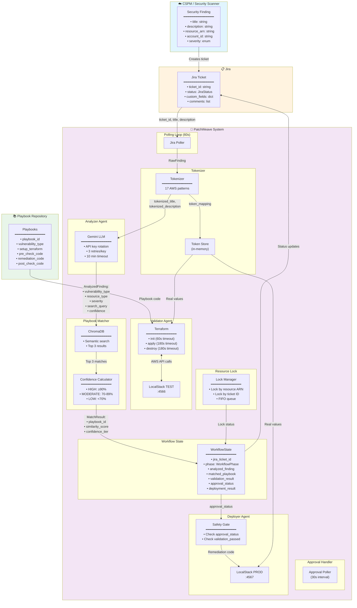
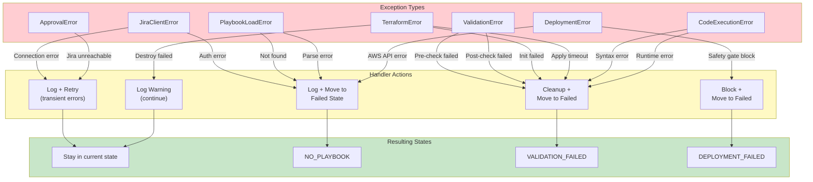
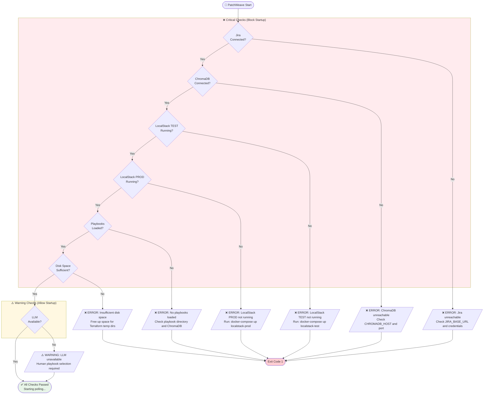
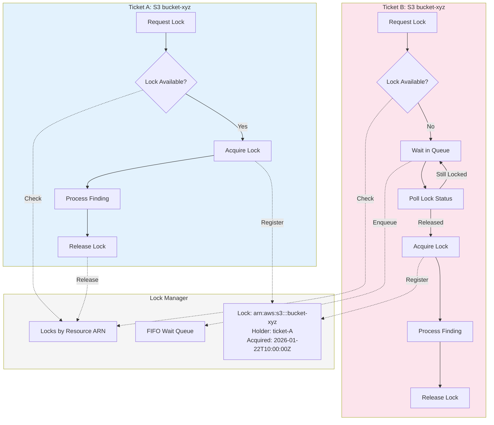
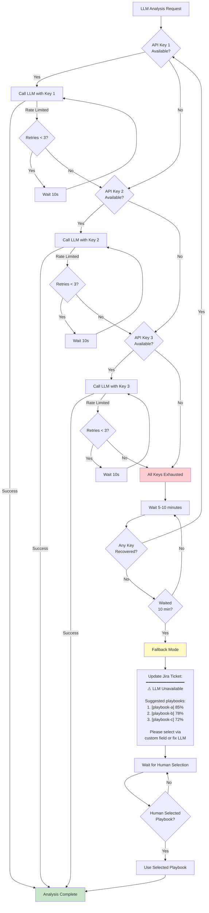

# PatchWeave State Flow Diagram

## Master State Flow Diagram (Complete System)

```mermaid
flowchart TB
    %% ═══════════════════════════════════════════════════════════════════════════
    %% STARTUP & PRE-FLIGHT CHECKS
    %% ═══════════════════════════════════════════════════════════════════════════
    
    subgraph STARTUP ["🚀 STARTUP - Pre-flight Checks"]
        direction TB
        START([PatchWeave Start]) --> CHK_JIRA{{"🔌 Jira<br/>Connected?"}}
        
        CHK_JIRA -->|"✓ Auth OK"| CHK_CHROMA{{"🔌 ChromaDB<br/>Connected?"}}
        CHK_JIRA -->|"✗ Failed"| FAIL_JIRA[/"❌ EXIT: Jira unreachable<br/>━━━━━━━━━━━━━━━━━━<br/>Check JIRA_BASE_URL"/]
        
        CHK_CHROMA -->|"✓ Collection exists"| CHK_LS_TEST{{"🐳 LocalStack TEST<br/>:4566 Running?"}}
        CHK_CHROMA -->|"✗ Failed"| FAIL_CHROMA[/"❌ EXIT: ChromaDB down<br/>━━━━━━━━━━━━━━━━━━<br/>Check CHROMADB_HOST"/]
        
        CHK_LS_TEST -->|"✓ Healthy"| CHK_LS_PROD{{"🐳 LocalStack PROD<br/>:4567 Running?"}}
        CHK_LS_TEST -->|"✗ Failed"| FAIL_LS_TEST[/"❌ EXIT: LocalStack TEST down<br/>━━━━━━━━━━━━━━━━━━<br/>docker-compose up localstack-test"/]
        
        CHK_LS_PROD -->|"✓ Healthy"| CHK_PLAYBOOKS{{"📚 Playbooks<br/>Loaded?"}}
        CHK_LS_PROD -->|"✗ Failed"| FAIL_LS_PROD[/"❌ EXIT: LocalStack PROD down<br/>━━━━━━━━━━━━━━━━━━<br/>docker-compose up localstack-prod"/]
        
        CHK_PLAYBOOKS -->|"✓ N > 0"| CHK_DISK{{"💾 Disk Space<br/>Sufficient?"}}
        CHK_PLAYBOOKS -->|"✗ Empty"| FAIL_PLAYBOOKS[/"❌ EXIT: No playbooks<br/>━━━━━━━━━━━━━━━━━━<br/>Load playbooks to ChromaDB"/]
        
        CHK_DISK -->|"✓ OK"| CHK_LLM{{"🤖 LLM<br/>Available?"}}
        CHK_DISK -->|"✗ Low"| FAIL_DISK[/"❌ EXIT: Disk full<br/>━━━━━━━━━━━━━━━━━━<br/>Free space for Terraform"/]
        
        CHK_LLM -->|"✓ Keys valid"| STARTUP_OK([✅ All Checks Passed])
        CHK_LLM -->|"✗ Unavailable"| LLM_WARN[/"⚠️ WARN: LLM unavailable<br/>Human selection mode"/]
        LLM_WARN --> STARTUP_OK
        
        FAIL_JIRA --> EXIT_1([Exit 1])
        FAIL_CHROMA --> EXIT_1
        FAIL_LS_TEST --> EXIT_1
        FAIL_LS_PROD --> EXIT_1
        FAIL_PLAYBOOKS --> EXIT_1
        FAIL_DISK --> EXIT_1
    end
    
    %% ═══════════════════════════════════════════════════════════════════════════
    %% POLLING & OPEN STATE
    %% ═══════════════════════════════════════════════════════════════════════════
    
    STARTUP_OK --> POLL_LOOP
    
    subgraph POLLING ["🔄 Polling Loop (Every 60s)"]
        POLL_LOOP[["Poll Jira API<br/>━━━━━━━━━━━━━━━━━━<br/>GET /search?jql=status=OPEN"]]
        POLL_LOOP --> FOUND_TICKETS{{"New Tickets<br/>Found?"}}
        FOUND_TICKETS -->|"No"| SLEEP_60["sleep(60s)"]
        SLEEP_60 --> POLL_LOOP
        FOUND_TICKETS -->|"Yes"| QUEUE_ADD["Add to Queue<br/>━━━━━━━━━━━━━━━━━━<br/>QueueItem(ticket_id,<br/>title, description)"]
    end
    
    %% ═══════════════════════════════════════════════════════════════════════════
    %% OPEN STATE
    %% ═══════════════════════════════════════════════════════════════════════════
    
    subgraph OPEN_STATE ["📋 OPEN"]
        direction TB
        OPEN_ENTRY(["RawFinding<br/>━━━━━━━━━━━━━━━━━━<br/>• ticket_id: string<br/>• title: string<br/>• description: string<br/>• resource_arn: string"])
        
        OPEN_ENTRY --> LOCK_CHECK{{"🔒 Resource<br/>Locked?"}}
        LOCK_CHECK -->|"Yes - Another ticket<br/>processing same resource"| WAIT_QUEUE["Wait in FIFO Queue<br/>━━━━━━━━━━━━━━━━━━<br/>Poll every 5s"]
        WAIT_QUEUE --> LOCK_CHECK
        LOCK_CHECK -->|"No - Available"| ACQUIRE_LOCK["Acquire Lock<br/>━━━━━━━━━━━━━━━━━━<br/>lock_key: resource_arn<br/>holder: ticket_id"]
    end
    
    QUEUE_ADD --> OPEN_ENTRY
    ACQUIRE_LOCK --> ANALYZING_ENTRY
    
    %% ═══════════════════════════════════════════════════════════════════════════
    %% ANALYZING STATE (Complex Internal Flow)
    %% ═══════════════════════════════════════════════════════════════════════════
    
    subgraph ANALYZING_STATE ["🔍 ANALYZING"]
        direction TB
        
        ANALYZING_ENTRY(["Enter ANALYZING<br/>━━━━━━━━━━━━━━━━━━<br/>Update Jira Status"])
        
        %% --- TOKENIZATION ---
        subgraph TOKENIZE ["🔐 Tokenization"]
            direction TB
            TOK_START["Tokenizer.tokenize_finding()"]
            TOK_START --> TOK_SIZE{{"Description<br/>> 500KB?"}}
            TOK_SIZE -->|"Yes"| TOK_TRUNCATE["Truncate + Update Jira<br/>━━━━━━━━━━━━━━━━━━<br/>⚠️ Description truncated"]
            TOK_SIZE -->|"No"| TOK_PATTERNS
            TOK_TRUNCATE --> TOK_PATTERNS
            
            TOK_PATTERNS["Apply 17 AWS Patterns<br/>━━━━━━━━━━━━━━━━━━<br/>• ACCOUNT_ID<br/>• BUCKET_NAME<br/>• ARN<br/>• ACCESS_KEY<br/>• etc."]
            
            TOK_PATTERNS --> TOK_OUTPUT(["TokenizedFinding<br/>━━━━━━━━━━━━━━━━━━<br/>• tokenized_title<br/>• tokenized_description<br/>• token_mapping"])
        end
        
        ANALYZING_ENTRY --> TOK_START
        
        %% --- LLM ANALYSIS ---
        subgraph LLM_BLOCK ["🤖 LLM Analysis"]
            direction TB
            LLM_CHECK{{"USE_LLM=true<br/>AND keys available?"}}
            
            LLM_CHECK -->|"Yes"| LLM_CALL
            LLM_CHECK -->|"No"| DIRECT_SEARCH_START
            
            subgraph LLM_RETRY ["API Key Rotation"]
                direction TB
                LLM_CALL["Call Gemini API<br/>━━━━━━━━━━━━━━━━━━<br/>key: GEMINI_API_KEY_N"]
                LLM_CALL --> LLM_RESP{{"Response?"}}
                LLM_RESP -->|"✓ 200 OK"| LLM_PARSE
                LLM_RESP -->|"✗ 429 Rate Limit"| ROTATE_KEY
                LLM_RESP -->|"✗ Error"| ROTATE_KEY
                
                ROTATE_KEY{{"Retries < 3<br/>per key?"}}
                ROTATE_KEY -->|"Yes"| WAIT_10S["Wait 10s"]
                WAIT_10S --> LLM_CALL
                ROTATE_KEY -->|"No"| NEXT_KEY{{"More API<br/>Keys?"}}
                NEXT_KEY -->|"Yes"| SWITCH_KEY["Switch to next key"]
                SWITCH_KEY --> LLM_CALL
                NEXT_KEY -->|"No"| ALL_EXHAUSTED
            end
            
            LLM_PARSE{{"Valid JSON?"}}
            LLM_PARSE -->|"Yes"| ANALYZED_FINDING
            LLM_PARSE -->|"No"| USE_DEFAULTS["Use Defaults<br/>━━━━━━━━━━━━━━━━━━<br/>type: unknown<br/>confidence: 0.5"]
            USE_DEFAULTS --> ANALYZED_FINDING
            
            ALL_EXHAUSTED["All Keys Exhausted"] --> LLM_WAIT["Wait 5-10 min<br/>━━━━━━━━━━━━━━━━━━<br/>Check every 30s"]
            LLM_WAIT --> LLM_RECOVER{{"Key<br/>Recovered?"}}
            LLM_RECOVER -->|"Yes"| LLM_CALL
            LLM_RECOVER -->|"No - 10min timeout"| UPDATE_JIRA_LLM["Update Jira:<br/>━━━━━━━━━━━━━━━━━━<br/>⚠️ LLM Unavailable<br/>Top 3 playbooks listed<br/>Please select manually"]
            UPDATE_JIRA_LLM --> DIRECT_SEARCH_START
            
            ANALYZED_FINDING(["AnalyzedFinding<br/>━━━━━━━━━━━━━━━━━━<br/>• vulnerability_type<br/>• resource_type<br/>• severity<br/>• search_query<br/>• confidence"])
        end
        
        TOK_OUTPUT --> LLM_CHECK
        
        %% --- PLAYBOOK SEARCH ---
        subgraph SEARCH_BLOCK ["🔎 Playbook Search"]
            direction TB
            DIRECT_SEARCH_START["ChromaDB Query<br/>━━━━━━━━━━━━━━━━━━<br/>collection.query(<br/>  query_texts=[search_query],<br/>  n_results=3)"]
            
            ANALYZED_FINDING --> CHROMA_QUERY
            CHROMA_QUERY["ChromaDB Semantic Search<br/>━━━━━━━━━━━━━━━━━━<br/>query: search_query<br/>OR raw title/description"]
            
            CHROMA_QUERY --> RANK_RESULTS["Rank by Similarity<br/>━━━━━━━━━━━━━━━━━━<br/>score = 1 - distance"]
            DIRECT_SEARCH_START --> RANK_RESULTS
            
            RANK_RESULTS --> MATCH_RESULTS(["MatchResults<br/>━━━━━━━━━━━━━━━━━━<br/>• playbook_1: 92%<br/>• playbook_2: 85%<br/>• playbook_3: 71%"])
        end
        
        %% --- CONFIDENCE ROUTING ---
        subgraph ROUTING ["🎯 Confidence Routing"]
            direction TB
            MATCH_RESULTS --> CONF_CHECK{{"Best Match<br/>Confidence?"}}
            
            CONF_CHECK -->|"≥ 90% HIGH"| AUTO_SELECT["Auto-Select Best<br/>━━━━━━━━━━━━━━━━━━<br/>✓ High confidence<br/>Proceed to validation"]
            
            CONF_CHECK -->|"70-89% MODERATE"| MOD_CHECK{{"LLM<br/>Available?"}}
            MOD_CHECK -->|"Yes"| LLM_SELECT["LLM Selects from Top 3<br/>━━━━━━━━━━━━━━━━━━<br/>Prompt: Which playbook<br/>best matches this finding?"]
            MOD_CHECK -->|"No"| HUMAN_SELECT
            LLM_SELECT --> LLM_PICKED(["LLM Selected<br/>playbook_id"])
            
            subgraph HUMAN_SELECT ["👤 Human Selection"]
                direction TB
                POST_OPTIONS["Post to Jira:<br/>━━━━━━━━━━━━━━━━━━<br/>Custom Field: playbook_options<br/>Comment: Please select<br/>1. [pb-1] 85%<br/>2. [pb-2] 78%<br/>3. [pb-3] 72%"]
                POST_OPTIONS --> WAIT_HUMAN["Wait for Selection<br/>━━━━━━━━━━━━━━━━━━<br/>Poll custom field"]
                WAIT_HUMAN --> HUMAN_PICKED{{"Field<br/>Filled?"}}
                HUMAN_PICKED -->|"No"| WAIT_HUMAN
                HUMAN_PICKED -->|"Yes"| READ_SELECTION["Read Selection"]
            end
            
            CONF_CHECK -->|"< 70% LOW"| NO_MATCH["No Suitable Playbook<br/>━━━━━━━━━━━━━━━━━━<br/>confidence too low"]
            
            AUTO_SELECT --> SELECTED_PLAYBOOK
            LLM_PICKED --> SELECTED_PLAYBOOK
            READ_SELECTION --> SELECTED_PLAYBOOK
            
            SELECTED_PLAYBOOK(["SelectedPlaybook<br/>━━━━━━━━━━━━━━━━━━<br/>• playbook_id<br/>• setup_terraform<br/>• pre_check_code<br/>• remediation_code<br/>• post_check_code"])
        end
    end
    
    SELECTED_PLAYBOOK --> VALIDATING_ENTRY
    NO_MATCH --> NO_PLAYBOOK_STATE
    
    %% ═══════════════════════════════════════════════════════════════════════════
    %% VALIDATING STATE (5 Stages)
    %% ═══════════════════════════════════════════════════════════════════════════
    
    subgraph VALIDATING_STATE ["🧪 VALIDATING"]
        direction TB
        
        VALIDATING_ENTRY(["Enter VALIDATING<br/>━━━━━━━━━━━━━━━━━━<br/>Update Jira Status<br/>Target: LocalStack TEST :4566"])
        
        %% Stage 1
        subgraph STAGE1 ["Stage 1: Environment Setup"]
            direction TB
            S1_INIT["terraform init<br/>━━━━━━━━━━━━━━━━━━<br/>timeout: 60s"]
            S1_INIT --> S1_INIT_OK{{"init OK?"}}
            S1_INIT_OK -->|"✓"| S1_APPLY["terraform apply -auto-approve<br/>━━━━━━━━━━━━━━━━━━<br/>timeout: 180s"]
            S1_INIT_OK -->|"✗"| S1_FAIL(["❌ SETUP_FAILED"])
            S1_APPLY --> S1_APPLY_OK{{"apply OK?"}}
            S1_APPLY_OK -->|"✓"| S1_PASS(["✅ Environment Ready<br/>━━━━━━━━━━━━━━━━━━<br/>resource_ids created"])
            S1_APPLY_OK -->|"✗ / timeout"| S1_FAIL
        end
        
        VALIDATING_ENTRY --> S1_INIT
        
        %% Stage 2
        subgraph STAGE2 ["Stage 2: Pre-Check"]
            direction TB
            S2_EXEC["exec(pre_check_code)<br/>━━━━━━━━━━━━━━━━━━<br/>Verify vuln exists"]
            S2_EXEC --> S2_RESULT{{"vulnerability<br/>_exists?"}}
            S2_RESULT -->|"✓ true"| S2_PASS(["✅ Vulnerability Confirmed"])
            S2_RESULT -->|"✗ false"| S2_FAIL(["❌ PRE_CHECK_FAILED<br/>Vulnerability not found"])
            S2_RESULT -->|"Exception"| S2_FAIL
        end
        
        S1_PASS --> S2_EXEC
        
        %% Stage 3
        subgraph STAGE3 ["Stage 3: Remediation"]
            direction TB
            S3_SUB["Substitute Tokens<br/>━━━━━━━━━━━━━━━━━━<br/>{{BUCKET}} → actual"]
            S3_SUB --> S3_EXEC["exec(remediation_code)<br/>━━━━━━━━━━━━━━━━━━<br/>Apply fix"]
            S3_EXEC --> S3_RESULT{{"success?"}}
            S3_RESULT -->|"✓ true"| S3_PASS(["✅ Remediation Applied"])
            S3_RESULT -->|"✗ false"| S3_FAIL(["❌ REMEDIATION_FAILED"])
            S3_RESULT -->|"Exception"| S3_FAIL
        end
        
        S2_PASS --> S3_SUB
        
        %% Stage 4
        subgraph STAGE4 ["Stage 4: Post-Check"]
            direction TB
            S4_EXEC["exec(post_check_code)<br/>━━━━━━━━━━━━━━━━━━<br/>Verify fix worked"]
            S4_EXEC --> S4_RESULT{{"verified?"}}
            S4_RESULT -->|"✓ true"| S4_PASS(["✅ Fix Verified"])
            S4_RESULT -->|"✗ false"| S4_FAIL(["❌ POST_CHECK_FAILED<br/>Fix didn't work"])
            S4_RESULT -->|"Exception"| S4_FAIL
        end
        
        S3_PASS --> S4_EXEC
        
        %% Stage 5 - ALWAYS RUNS
        subgraph STAGE5 ["Stage 5: Cleanup ⭐ ALWAYS RUNS"]
            direction TB
            S5_DESTROY["terraform destroy -auto-approve<br/>━━━━━━━━━━━━━━━━━━<br/>timeout: 180s"]
            S5_DESTROY --> S5_DESTROY_OK{{"destroy OK?"}}
            S5_DESTROY_OK -->|"✓"| S5_RMDIR
            S5_DESTROY_OK -->|"✗"| S5_RESTART["docker restart localstack-test<br/>━━━━━━━━━━━━━━━━━━<br/>Wait for healthy"]
            S5_RESTART --> S5_RMDIR
            S5_RMDIR["shutil.rmtree(tf_dir)<br/>━━━━━━━━━━━━━━━━━━<br/>ignore_errors=True"]
            S5_RMDIR --> S5_DONE(["Cleanup Complete"])
        end
        
        %% All paths lead to cleanup
        S4_PASS --> S5_DESTROY
        S4_FAIL --> S5_DESTROY
        S3_FAIL --> S5_DESTROY
        S2_FAIL --> S5_DESTROY
        S1_FAIL --> S5_DESTROY
        
        %% Final decision
        S5_DONE --> VAL_DECISION{{"All Stages<br/>Passed?"}}
        VAL_DECISION -->|"✓ Yes"| VAL_SUCCESS(["ValidationResult<br/>━━━━━━━━━━━━━━━━━━<br/>success: true<br/>all_stages: PASSED"])
        VAL_DECISION -->|"✗ No"| VAL_FAILED_OUT(["ValidationResult<br/>━━━━━━━━━━━━━━━━━━<br/>success: false<br/>failed_stage: X"])
    end
    
    VAL_SUCCESS --> PENDING_ENTRY
    VAL_FAILED_OUT --> VAL_FAILED_STATE
    
    %% ═══════════════════════════════════════════════════════════════════════════
    %% PENDING_APPROVAL STATE
    %% ═══════════════════════════════════════════════════════════════════════════
    
    subgraph PENDING_STATE ["⏳ PENDING_APPROVAL"]
        direction TB
        
        PENDING_ENTRY(["Enter PENDING_APPROVAL<br/>━━━━━━━━━━━━━━━━━━<br/>Update Jira Status"])
        
        PENDING_ENTRY --> POST_APPROVAL["Post Approval Request<br/>━━━━━━━━━━━━━━━━━━<br/>Comment with:<br/>• Playbook details<br/>• Validation results<br/>• Resource to remediate<br/>• Request approval"]
        
        POST_APPROVAL --> APPROVAL_POLL["Poll Jira Status<br/>━━━━━━━━━━━━━━━━━━<br/>Every 30s"]
        
        APPROVAL_POLL --> APPROVAL_CHECK{{"Jira Status?"}}
        APPROVAL_CHECK -->|"Still PENDING"| APPROVAL_POLL
        APPROVAL_CHECK -->|"APPROVED / DONE"| APPROVED_OUT(["ApprovalResult<br/>━━━━━━━━━━━━━━━━━━<br/>decision: APPROVED<br/>approver: user_id<br/>timestamp: now"])
        APPROVAL_CHECK -->|"REJECTED"| REJECTED_OUT(["ApprovalResult<br/>━━━━━━━━━━━━━━━━━━<br/>decision: REJECTED<br/>rejector: user_id"])
    end
    
    APPROVED_OUT --> DEPLOYING_ENTRY
    REJECTED_OUT --> REJECTED_STATE
    
    %% ═══════════════════════════════════════════════════════════════════════════
    %% DEPLOYING STATE
    %% ═══════════════════════════════════════════════════════════════════════════
    
    subgraph DEPLOYING_STATE ["🚀 DEPLOYING"]
        direction TB
        
        DEPLOYING_ENTRY(["Enter DEPLOYING<br/>━━━━━━━━━━━━━━━━━━<br/>Update Jira Status<br/>Target: LocalStack PROD :4567"])
        
        %% Safety Gates
        subgraph SAFETY ["🛡️ Safety Gates"]
            direction TB
            GATE1{{"approval_status<br/>== APPROVED?"}}
            GATE1 -->|"✓"| GATE2{{"validation<br/>_successful?"}}
            GATE1 -->|"✗"| BLOCKED["🚫 BLOCKED<br/>━━━━━━━━━━━━━━━━━━<br/>DeploymentError:<br/>Not approved"]
            GATE2 -->|"✓"| GATES_PASS(["Gates Passed"])
            GATE2 -->|"✗"| BLOCKED2["🚫 BLOCKED<br/>━━━━━━━━━━━━━━━━━━<br/>DeploymentError:<br/>Validation failed"]
        end
        
        DEPLOYING_ENTRY --> GATE1
        
        %% Dry Run Check
        GATES_PASS --> DRY_CHECK{{"DRY_RUN<br/>== true?"}}
        DRY_CHECK -->|"Yes"| DRY_RUN["Syntax Check Only<br/>━━━━━━━━━━━━━━━━━━<br/>No AWS changes"]
        DRY_CHECK -->|"No"| PROD_EXEC
        
        %% Production Execution
        subgraph PROD ["Production Execution"]
            direction TB
            PROD_EXEC["Substitute Tokens<br/>━━━━━━━━━━━━━━━━━━<br/>{{BUCKET}} → real value"]
            PROD_EXEC --> PROD_RUN["exec(remediation_code)<br/>━━━━━━━━━━━━━━━━━━<br/>AWS API calls"]
            PROD_RUN --> PROD_RESULT{{"Success?"}}
            PROD_RESULT -->|"✓"| PROD_SUCCESS["Post Success Comment<br/>━━━━━━━━━━━━━━━━━━<br/>✅ Remediation complete"]
            PROD_RESULT -->|"✗ ClientError"| PROD_FAIL["Post Failure Comment<br/>━━━━━━━━━━━━━━━━━━<br/>❌ AWS Error: ..."]
            PROD_RESULT -->|"✗ Exception"| PROD_FAIL
            
            PROD_SUCCESS --> RECORD_LEARNING["Record Learning<br/>━━━━━━━━━━━━━━━━━━<br/>Audit log entry"]
        end
        
        DRY_RUN --> DEPLOY_SUCCESS_OUT
        RECORD_LEARNING --> DEPLOY_SUCCESS_OUT
        
        DEPLOY_SUCCESS_OUT(["DeploymentResult<br/>━━━━━━━━━━━━━━━━━━<br/>success: true"])
        DEPLOY_FAIL_OUT(["DeploymentResult<br/>━━━━━━━━━━━━━━━━━━<br/>success: false<br/>error: message"])
        
        BLOCKED --> DEPLOY_FAIL_OUT
        BLOCKED2 --> DEPLOY_FAIL_OUT
        PROD_FAIL --> DEPLOY_FAIL_OUT
    end
    
    DEPLOY_SUCCESS_OUT --> RESOLVED_STATE
    DEPLOY_FAIL_OUT --> DEPLOY_FAILED_STATE
    
    %% ═══════════════════════════════════════════════════════════════════════════
    %% TERMINAL STATES
    %% ═══════════════════════════════════════════════════════════════════════════
    
    subgraph TERMINALS ["Terminal States"]
        direction TB
        
        RESOLVED_STATE(["✅ RESOLVED<br/>━━━━━━━━━━━━━━━━━━<br/>Remediation successful<br/>Ticket can be closed"])
        
        NO_PLAYBOOK_STATE(["📭 NO_PLAYBOOK<br/>━━━━━━━━━━━━━━━━━━<br/>No suitable playbook<br/>confidence < 70%"])
        
        VAL_FAILED_STATE(["❌ VALIDATION_FAILED<br/>━━━━━━━━━━━━━━━━━━<br/>Playbook failed in test<br/>Stage: failed_stage"])
        
        DEPLOY_FAILED_STATE(["💥 DEPLOYMENT_FAILED<br/>━━━━━━━━━━━━━━━━━━<br/>Production deployment failed<br/>Error: message"])
        
        REJECTED_STATE(["🚫 REJECTED<br/>━━━━━━━━━━━━━━━━━━<br/>Human rejected remediation"])
    end
    
    %% ═══════════════════════════════════════════════════════════════════════════
    %% RECOVERY PATHS (Manual)
    %% ═══════════════════════════════════════════════════════════════════════════
    
    NO_PLAYBOOK_STATE -.->|"👤 Manual: Move to OPEN in Jira"| OPEN_ENTRY
    VAL_FAILED_STATE -.->|"👤 Manual: Move to OPEN in Jira"| OPEN_ENTRY
    DEPLOY_FAILED_STATE -.->|"👤 Manual: Move to OPEN in Jira"| OPEN_ENTRY
    REJECTED_STATE -.->|"👤 Manual: Move to OPEN in Jira"| OPEN_ENTRY
    
    %% ═══════════════════════════════════════════════════════════════════════════
    %% LOCK RELEASE (happens on exit from workflow)
    %% ═══════════════════════════════════════════════════════════════════════════
    
    RESOLVED_STATE --> RELEASE_LOCK["🔓 Release Lock<br/>━━━━━━━━━━━━━━━━━━<br/>lock_key: resource_arn"]
    NO_PLAYBOOK_STATE --> RELEASE_LOCK
    VAL_FAILED_STATE --> RELEASE_LOCK
    DEPLOY_FAILED_STATE --> RELEASE_LOCK
    REJECTED_STATE --> RELEASE_LOCK
    
    RELEASE_LOCK --> END_STATE([End])
    
    %% ═══════════════════════════════════════════════════════════════════════════
    %% STYLING
    %% ═══════════════════════════════════════════════════════════════════════════
    
    style STARTUP fill:#e3f2fd,stroke:#1565c0
    style POLLING fill:#f3e5f5,stroke:#7b1fa2
    style OPEN_STATE fill:#fff3e0,stroke:#ef6c00
    style ANALYZING_STATE fill:#e8f5e9,stroke:#2e7d32
    style VALIDATING_STATE fill:#fff8e1,stroke:#f9a825
    style PENDING_STATE fill:#fce4ec,stroke:#c2185b
    style DEPLOYING_STATE fill:#e1f5fe,stroke:#0277bd
    style TERMINALS fill:#fafafa,stroke:#616161
    
    style STAGE1 fill:#e3f2fd
    style STAGE2 fill:#e8f5e9
    style STAGE3 fill:#fff3e0
    style STAGE4 fill:#f3e5f5
    style STAGE5 fill:#ffebee
    
    style RESOLVED_STATE fill:#c8e6c9,stroke:#2e7d32
    style NO_PLAYBOOK_STATE fill:#fff9c4,stroke:#f9a825
    style VAL_FAILED_STATE fill:#ffcdd2,stroke:#c62828
    style DEPLOY_FAILED_STATE fill:#ffcdd2,stroke:#c62828
    style REJECTED_STATE fill:#ffcdd2,stroke:#c62828
    
    style EXIT_1 fill:#ffcdd2,stroke:#c62828
```

---

## Quick Reference

### Jira Board States (External)
| State | Purpose |
|-------|---------|
| OPEN | New finding, waiting for processing |
| ANALYZING | LLM analysis + playbook search in progress |
| VALIDATING | Testing playbook in LocalStack |
| PENDING_APPROVAL | Awaiting human approval |
| DEPLOYING | Executing on production |
| RESOLVED | ✅ Success - remediation complete |
| NO_PLAYBOOK | ❌ No suitable playbook found |
| VALIDATION_FAILED | ❌ Playbook failed in test environment |
| DEPLOYMENT_FAILED | ❌ Production deployment failed |
| REJECTED | ❌ Human rejected the remediation |

### Internal Phases (Not visible in Jira)
| Phase | Parent Jira State | Purpose |
|-------|-------------------|---------|
| TOKENIZING | ANALYZING | Replace sensitive data with placeholders |
| LLM_ANALYSIS | ANALYZING | Extract vulnerability info via Gemini |
| PLAYBOOK_SEARCH | ANALYZING | ChromaDB semantic search |
| CONFIDENCE_ROUTING | ANALYZING | Route based on match confidence |
| HUMAN_SELECTION | ANALYZING | Human picks playbook (when LLM disabled) |

---

## Complete State Flow Diagram

```mermaid
stateDiagram-v2
    direction TB
    
    %% ============================================
    %% STARTUP PRE-FLIGHT CHECKS
    %% ============================================
    
    state "🚀 STARTUP" as STARTUP {
        [*] --> PreflightChecks
        
        state "Pre-flight Checks" as PreflightChecks {
            [*] --> CheckJira
            CheckJira --> CheckChromaDB: ✓ Connected
            CheckJira --> StartupFailed: ✗ Unreachable
            CheckChromaDB --> CheckLocalStackTest: ✓ Connected
            CheckChromaDB --> StartupFailed: ✗ Unreachable
            CheckLocalStackTest --> CheckLocalStackProd: ✓ Running
            CheckLocalStackTest --> StartupFailed: ✗ Not running
            CheckLocalStackProd --> CheckPlaybooks: ✓ Running
            CheckLocalStackProd --> StartupFailed: ✗ Not running
            CheckPlaybooks --> CheckDiskSpace: ✓ Playbooks loaded
            CheckPlaybooks --> StartupFailed: ✗ No playbooks
            CheckDiskSpace --> CheckLLM: ✓ Sufficient
            CheckDiskSpace --> StartupFailed: ✗ Insufficient
            CheckLLM --> AllChecksPass: ✓ Available
            CheckLLM --> AllChecksPass: ⚠ Unavailable (warn only)
        }
        
        StartupFailed --> [*]: Exit with error
        AllChecksPass --> StartPolling
    }
    
    %% ============================================
    %% MAIN WORKFLOW
    %% ============================================
    
    state "📋 OPEN" as OPEN
    state "🔍 ANALYZING" as ANALYZING
    state "🧪 VALIDATING" as VALIDATING
    state "⏳ PENDING_APPROVAL" as PENDING_APPROVAL
    state "🚀 DEPLOYING" as DEPLOYING
    state "✅ RESOLVED" as RESOLVED
    state "📭 NO_PLAYBOOK" as NO_PLAYBOOK
    state "❌ VALIDATION_FAILED" as VALIDATION_FAILED
    state "💥 DEPLOYMENT_FAILED" as DEPLOYMENT_FAILED
    state "🚫 REJECTED" as REJECTED
    
    %% Main flow
    StartPolling --> OPEN: Poll every 60s
    OPEN --> ANALYZING: Finding discovered
    
    %% ANALYZING internal states
    state ANALYZING {
        [*] --> AcquireLock
        
        AcquireLock --> Tokenizing: Lock acquired
        AcquireLock --> WaitForLock: Resource locked by another ticket
        WaitForLock --> AcquireLock: Retry after delay
        
        Tokenizing --> LLMAnalysis: Tokens generated
        Tokenizing --> LLMAnalysis: Desc > 500KB → Update ticket, truncate
        
        state "LLM Available?" as LLMCheck
        LLMAnalysis --> LLMCheck
        
        LLMCheck --> LLMProcess: Yes
        LLMCheck --> DirectSearch: No (disabled/exhausted)
        
        state "LLM Processing" as LLMProcess {
            [*] --> CallLLM
            CallLLM --> ParseResponse: Response received
            CallLLM --> RotateKey: Rate limited
            RotateKey --> CallLLM: Retry (max 3 per key)
            RotateKey --> LLMExhausted: All keys exhausted
            ParseResponse --> ExtractInfo: Valid JSON
            ParseResponse --> UseDefaults: Invalid JSON
            UseDefaults --> ExtractInfo
        }
        
        LLMExhausted --> WaitAndRetry: Wait 5-10 min
        WaitAndRetry --> LLMExhausted: Still unavailable
        WaitAndRetry --> CallLLM: LLM recovered
        LLMExhausted --> UpdateTicketLLMFailed: Timeout (10 min)
        UpdateTicketLLMFailed --> DirectSearch: Show top 3 playbooks
        
        ExtractInfo --> PlaybookSearch
        DirectSearch --> PlaybookSearch: Raw text search
        
        state "Playbook Search" as PlaybookSearch {
            [*] --> ChromaDBQuery
            ChromaDBQuery --> RankResults: Results found
            ChromaDBQuery --> NoResults: No matches
        }
        
        NoResults --> ConfidenceRouting: confidence = 0
        RankResults --> ConfidenceRouting
        
        state "Confidence Routing" as ConfidenceRouting {
            [*] --> CheckConfidence
            CheckConfidence --> HighConfidence: ≥ 90%
            CheckConfidence --> ModerateConfidence: 70-89%
            CheckConfidence --> LowConfidence: < 70%
        }
        
        HighConfidence --> SelectPlaybook: Auto-select best match
        
        state "LLM Selects Playbook" as LLMSelectPlaybook
        ModerateConfidence --> LLMSelectPlaybook: LLM available
        ModerateConfidence --> HumanSelection: LLM unavailable
        LLMSelectPlaybook --> SelectPlaybook: LLM picks from top 3
        
        state "Human Selection" as HumanSelection {
            [*] --> PostTop3ToJira
            PostTop3ToJira --> WaitForHumanChoice
            WaitForHumanChoice --> ReadCustomField: Human selected
        }
        ReadCustomField --> SelectPlaybook
        
        LowConfidence --> NoPlaybookExit
        SelectPlaybook --> ValidationReady
    }
    
    ANALYZING --> VALIDATING: ValidationReady (playbook selected)
    ANALYZING --> NO_PLAYBOOK: NoPlaybookExit (confidence < 70%)
    
    %% VALIDATING internal states  
    state VALIDATING {
        [*] --> Stage1_Setup
        
        state "Stage 1: Environment Setup" as Stage1_Setup {
            [*] --> TerraformInit
            TerraformInit --> TerraformApply: init success
            TerraformInit --> SetupFailed: init failed
            TerraformApply --> SetupComplete: apply success
            TerraformApply --> SetupFailed: apply failed (180s timeout)
        }
        
        SetupComplete --> Stage2_PreCheck
        
        state "Stage 2: Pre-Check" as Stage2_PreCheck {
            [*] --> ExecutePreCheck
            ExecutePreCheck --> VulnExists: vulnerability_exists = true
            ExecutePreCheck --> PreCheckFailed: vulnerability_exists = false
            ExecutePreCheck --> PreCheckFailed: execution error
        }
        
        VulnExists --> Stage3_Remediation
        
        state "Stage 3: Remediation" as Stage3_Remediation {
            [*] --> SubstituteTokens
            SubstituteTokens --> ExecuteRemediation
            ExecuteRemediation --> RemediationSuccess: success = true
            ExecuteRemediation --> RemediationFailed: success = false
            ExecuteRemediation --> RemediationFailed: execution error
        }
        
        RemediationSuccess --> Stage4_PostCheck
        
        state "Stage 4: Post-Check" as Stage4_PostCheck {
            [*] --> ExecutePostCheck
            ExecutePostCheck --> VerifyFixed: verified = true
            ExecutePostCheck --> PostCheckFailed: verified = false
            ExecutePostCheck --> PostCheckFailed: execution error
        }
        
        VerifyFixed --> Stage5_Cleanup
        
        state "Stage 5: Cleanup (ALWAYS RUNS)" as Stage5_Cleanup {
            [*] --> TerraformDestroy
            TerraformDestroy --> CleanupComplete: destroy success
            TerraformDestroy --> RestartLocalStack: destroy failed
            RestartLocalStack --> DockerRestart
            DockerRestart --> WaitContainerReady
            WaitContainerReady --> CleanupComplete
            CleanupComplete --> RemoveTempDir
            RemoveTempDir --> CleanupDone
        }
        
        %% Failure paths all go to cleanup
        SetupFailed --> Stage5_Cleanup
        PreCheckFailed --> Stage5_Cleanup
        RemediationFailed --> Stage5_Cleanup
        PostCheckFailed --> Stage5_Cleanup
        
        CleanupDone --> ValidationPassed: All stages passed
        CleanupDone --> ValidationFailedExit: Any stage failed
    }
    
    VALIDATING --> PENDING_APPROVAL: ValidationPassed
    VALIDATING --> VALIDATION_FAILED: ValidationFailedExit
    
    %% PENDING_APPROVAL
    state PENDING_APPROVAL {
        [*] --> PostApprovalRequest
        PostApprovalRequest --> PollApprovalStatus
        PollApprovalStatus --> CheckJiraStatus: Every 30s
        CheckJiraStatus --> PollApprovalStatus: Still pending
        CheckJiraStatus --> ApprovalGranted: Status = APPROVED
        CheckJiraStatus --> ApprovalRejected: Status = REJECTED
    }
    
    PENDING_APPROVAL --> DEPLOYING: ApprovalGranted
    PENDING_APPROVAL --> REJECTED: ApprovalRejected
    
    %% DEPLOYING
    state DEPLOYING {
        [*] --> SafetyGateCheck
        
        state "Safety Gate" as SafetyGateCheck {
            [*] --> CheckApprovalStatus
            CheckApprovalStatus --> CheckValidationPassed: approval_status = APPROVED
            CheckApprovalStatus --> BlockDeployment: approval_status ≠ APPROVED
            CheckValidationPassed --> ProceedDeployment: validation_successful = true
            CheckValidationPassed --> BlockDeployment: validation_successful = false
        }
        
        BlockDeployment --> DeploymentBlocked
        
        ProceedDeployment --> CheckDryRun
        CheckDryRun --> SyntaxCheckOnly: DRY_RUN = true
        CheckDryRun --> ProductionExecution: DRY_RUN = false
        
        SyntaxCheckOnly --> DeploymentComplete: Syntax valid
        
        state "Production Execution" as ProductionExecution {
            [*] --> SubstituteTokensProd
            SubstituteTokensProd --> ExecuteOnProd
            ExecuteOnProd --> AWSCallSuccess: AWS API success
            ExecuteOnProd --> AWSCallFailed: ClientError / Exception
        }
        
        AWSCallSuccess --> PostSuccessComment
        PostSuccessComment --> RecordLearning
        RecordLearning --> DeploymentComplete
        
        AWSCallFailed --> PostFailureComment
        PostFailureComment --> DeploymentFailedExit
    }
    
    DEPLOYING --> RESOLVED: DeploymentComplete
    DEPLOYING --> DEPLOYMENT_FAILED: DeploymentFailedExit
    DEPLOYING --> DEPLOYMENT_FAILED: DeploymentBlocked
    
    %% Terminal states can return to OPEN
    NO_PLAYBOOK --> OPEN: Manual: Move ticket to OPEN
    VALIDATION_FAILED --> OPEN: Manual: Move ticket to OPEN
    DEPLOYMENT_FAILED --> OPEN: Manual: Move ticket to OPEN
    REJECTED --> OPEN: Manual: Move ticket to OPEN
    
    %% Final states
    RESOLVED --> [*]
```



---

## Detailed Data Flow Diagram



---

## Transition Table with Triggers and Data

### State Transitions

| From | To | Trigger | Data Passed | Condition |
|------|-----|---------|-------------|-----------|
| - | OPEN | CSPM creates Jira ticket | `ticket_id`, `title`, `description` | New security finding |
| OPEN | ANALYZING | Polling discovers ticket | `RawFinding` | `status == OPEN` |
| ANALYZING | VALIDATING | Playbook selected | `AnalyzedFinding`, `MatchedPlaybook`, `token_mapping` | `confidence >= 70%` AND playbook selected |
| ANALYZING | NO_PLAYBOOK | No suitable match | `AnalyzedFinding` | `confidence < 70%` |
| VALIDATING | PENDING_APPROVAL | All 5 stages pass | `ValidationResult` | `all_stages_passed == true` |
| VALIDATING | VALIDATION_FAILED | Any stage fails | `ValidationResult`, `failed_stage`, `error` | `any_stage_failed == true` |
| PENDING_APPROVAL | DEPLOYING | Human approves | `approver_id`, `approval_timestamp` | Jira status = APPROVED |
| PENDING_APPROVAL | REJECTED | Human rejects | `rejector_id`, `rejection_reason` | Jira status = REJECTED |
| DEPLOYING | RESOLVED | Deployment succeeds | `DeploymentResult` | `success == true` |
| DEPLOYING | DEPLOYMENT_FAILED | Deployment fails | `DeploymentResult`, `error` | `success == false` |
| NO_PLAYBOOK | OPEN | Manual re-open | - | User moves ticket in Jira |
| VALIDATION_FAILED | OPEN | Manual re-open | - | User moves ticket in Jira |
| DEPLOYMENT_FAILED | OPEN | Manual re-open | - | User moves ticket in Jira |
| REJECTED | OPEN | Manual re-open | - | User moves ticket in Jira |

### Internal ANALYZING Transitions

| From | To | Trigger | Data | Condition |
|------|-----|---------|------|-----------|
| Entry | AcquireLock | Start processing | `resource_arn`, `ticket_id` | - |
| AcquireLock | WaitForLock | Resource locked | - | Another ticket has lock |
| AcquireLock | Tokenizing | Lock acquired | `lock_id` | Lock available |
| Tokenizing | LLMAnalysis | Tokens generated | `tokenized_title`, `tokenized_description`, `token_mapping` | - |
| Tokenizing | LLMAnalysis | Desc too large | `truncated_description` | `len(description) > 500KB` |
| LLMAnalysis | LLMProcess | LLM available | - | `USE_LLM == true` AND keys available |
| LLMAnalysis | DirectSearch | LLM unavailable | - | `USE_LLM == false` OR all keys exhausted |
| LLMProcess | PlaybookSearch | Analysis complete | `AnalyzedFinding` | Valid response |
| LLMProcess | RotateKey | Rate limited | - | 429 error |
| RotateKey | LLMProcess | Retry | `new_api_key` | Retries < max |
| RotateKey | LLMExhausted | All keys tried | - | All keys rate limited |
| LLMExhausted | WaitAndRetry | Start waiting | - | Wait 5-10 min |
| WaitAndRetry | LLMProcess | LLM recovered | - | Key available |
| WaitAndRetry | UpdateTicketLLMFailed | Timeout | - | Waited 10 min |
| UpdateTicketLLMFailed | DirectSearch | Human notified | `top_3_playbooks` | Post to Jira |
| DirectSearch | PlaybookSearch | Search complete | `raw_search_results` | - |
| PlaybookSearch | ConfidenceRouting | Results ranked | `ranked_matches` | - |
| ConfidenceRouting | SelectPlaybook | High confidence | `best_match` | `score >= 90%` |
| ConfidenceRouting | LLMSelectPlaybook | Moderate + LLM | `top_3_matches` | `70% <= score < 90%` AND LLM available |
| ConfidenceRouting | HumanSelection | Moderate + no LLM | `top_3_matches` | `70% <= score < 90%` AND LLM unavailable |
| ConfidenceRouting | NoPlaybookExit | Low confidence | - | `score < 70%` |
| LLMSelectPlaybook | SelectPlaybook | LLM picks | `selected_playbook` | LLM decision |
| HumanSelection | SelectPlaybook | Human picks | `selected_playbook` | Custom field filled |
| SelectPlaybook | ValidationReady | Playbook ready | `playbook_id`, `playbook_code` | - |

### Internal VALIDATING Transitions

| From | To | Trigger | Data | Condition |
|------|-----|---------|------|-----------|
| Entry | Stage1_Setup | Start validation | `playbook.setup_terraform` | - |
| Stage1_Setup | Stage2_PreCheck | Setup complete | `terraform_state`, `resource_ids` | `init` and `apply` succeed |
| Stage1_Setup | Stage5_Cleanup | Setup failed | `error` | `init` or `apply` fails |
| Stage2_PreCheck | Stage3_Remediation | Vuln confirmed | `pre_check_result` | `vulnerability_exists == true` |
| Stage2_PreCheck | Stage5_Cleanup | Vuln not found | `error` | `vulnerability_exists == false` |
| Stage3_Remediation | Stage4_PostCheck | Remediation done | `remediation_result` | `success == true` |
| Stage3_Remediation | Stage5_Cleanup | Remediation failed | `error` | `success == false` |
| Stage4_PostCheck | Stage5_Cleanup | Check complete | `post_check_result` | Always (pass or fail) |
| Stage5_Cleanup | ValidationPassed | All passed | `ValidationResult` | All stages succeeded |
| Stage5_Cleanup | ValidationFailedExit | Any failed | `ValidationResult`, `failed_stage` | Any stage failed |
| TerraformDestroy | RestartLocalStack | Destroy failed | `error` | Terraform error |
| RestartLocalStack | CleanupComplete | Container restarted | - | Docker restart success |

---

## Exception Handling Flow



---

## Startup Pre-flight Check Flow



---

## Resource Locking Flow



---

## LLM Failure Recovery Flow



---

## Validation Stage Flow with Cleanup

```mermaid
flowchart TB
    subgraph Validation ["🧪 VALIDATING State"]
        Start([Enter VALIDATING]) --> S1
        
        subgraph S1 ["Stage 1: Environment Setup"]
            S1_Start[Start] --> S1_Init[terraform init]
            S1_Init -->|Success| S1_Apply[terraform apply]
            S1_Init -->|Fail| S1_Fail([❌ Setup Failed])
            S1_Apply -->|Success<br/>≤180s| S1_Pass([✅ Setup Complete])
            S1_Apply -->|Fail/Timeout| S1_Fail
        end
        
        S1_Pass --> S2
        
        subgraph S2 ["Stage 2: Pre-Check"]
            S2_Start[Start] --> S2_Exec["exec(pre_check_code)"]
            S2_Exec -->|vulnerability_exists=true| S2_Pass([✅ Vulnerability Confirmed])
            S2_Exec -->|vulnerability_exists=false| S2_Fail([❌ Pre-Check Failed])
            S2_Exec -->|Exception| S2_Fail
        end
        
        S2_Pass --> S3
        
        subgraph S3 ["Stage 3: Remediation"]
            S3_Start[Start] --> S3_Sub[Substitute Tokens]
            S3_Sub --> S3_Exec["exec(remediation_code)"]
            S3_Exec -->|success=true| S3_Pass([✅ Remediation Applied])
            S3_Exec -->|success=false| S3_Fail([❌ Remediation Failed])
            S3_Exec -->|Exception| S3_Fail
        end
        
        S3_Pass --> S4
        
        subgraph S4 ["Stage 4: Post-Check"]
            S4_Start[Start] --> S4_Exec["exec(post_check_code)"]
            S4_Exec -->|verified=true| S4_Pass([✅ Fix Verified])
            S4_Exec -->|verified=false| S4_Fail([❌ Post-Check Failed])
            S4_Exec -->|Exception| S4_Fail
        end
        
        S4_Pass --> S5
        S4_Fail --> S5
        
        subgraph S5 ["Stage 5: Cleanup (ALWAYS RUNS)"]
            S5_Start[Start] --> S5_Destroy[terraform destroy]
            S5_Destroy -->|Success| S5_Clean[shutil.rmtree]
            S5_Destroy -->|Fail| S5_Restart[docker restart localstack-test]
            S5_Restart --> S5_Wait[Wait for container ready]
            S5_Wait --> S5_Clean
            S5_Clean --> S5_Done([Cleanup Complete])
        end
        
        %% All failures route to cleanup
        S1_Fail --> S5
        S2_Fail --> S5
        S3_Fail --> S5
        
        S5_Done --> Decision{All Stages<br/>Passed?}
        Decision -->|Yes| Pass([→ PENDING_APPROVAL])
        Decision -->|No| Fail([→ VALIDATION_FAILED])
    end
    
    style S1 fill:#e3f2fd
    style S2 fill:#e8f5e9
    style S3 fill:#fff3e0
    style S4 fill:#f3e5f5
    style S5 fill:#ffebee
    style Pass fill:#c8e6c9
    style Fail fill:#ffcdd2
```



---

## Metrics & Monitoring (Industry Best Practice)

### Prometheus Metrics to Export

```yaml
# Counter metrics
patchweave_findings_total:
  type: counter
  labels: [final_state]  # RESOLVED, NO_PLAYBOOK, VALIDATION_FAILED, etc.
  description: Total findings processed by final state

patchweave_state_transitions_total:
  type: counter
  labels: [from_state, to_state]
  description: Count of state transitions

patchweave_llm_requests_total:
  type: counter
  labels: [status]  # success, rate_limited, error
  description: LLM API call outcomes

patchweave_validation_stages_total:
  type: counter
  labels: [stage, status]  # SETUP/success, PRE_CHECK/failed, etc.
  description: Validation stage outcomes

patchweave_deployments_total:
  type: counter
  labels: [status, dry_run]  # success/false, failed/true
  description: Deployment outcomes

# Gauge metrics
patchweave_findings_by_state:
  type: gauge
  labels: [state]
  description: Current count of findings in each state

patchweave_queue_size:
  type: gauge
  description: Current size of processing queue

patchweave_active_locks:
  type: gauge
  description: Number of active resource locks

# Histogram metrics
patchweave_finding_duration_seconds:
  type: histogram
  labels: [final_state]
  buckets: [60, 300, 900, 3600, 14400, 86400]
  description: Time from OPEN to terminal state

patchweave_llm_latency_seconds:
  type: histogram
  buckets: [0.5, 1, 2, 5, 10, 30]
  description: LLM response time

patchweave_validation_duration_seconds:
  type: histogram
  labels: [stage]
  buckets: [5, 15, 30, 60, 120, 180]
  description: Duration of each validation stage

patchweave_approval_wait_seconds:
  type: histogram
  buckets: [300, 900, 3600, 14400, 43200, 86400]
  description: Time spent waiting for approval

# Summary metrics
patchweave_playbook_confidence:
  type: summary
  quantiles: [0.5, 0.9, 0.99]
  description: Distribution of playbook match confidence scores
```

### Alerting Thresholds (Recommended)

| Metric | Warning | Critical | Action |
|--------|---------|----------|--------|
| `validation_pass_rate` | < 80% | < 60% | Review playbook quality |
| `deployment_success_rate` | < 90% | < 70% | Investigate PROD environment |
| `llm_error_rate` | > 10% | > 30% | Check API keys |
| `avg_approval_wait_time` | > 4h | > 12h | Escalate to approvers |
| `queue_size` | > 50 | > 100 | Scale processing |
| `active_locks` | > 10 | > 20 | Check for stuck workflows |

### Audit Trail (What to Record)

| Event | Fields to Record |
|-------|------------------|
| State Transition | `timestamp`, `ticket_id`, `from_state`, `to_state`, `trigger`, `actor` |
| Playbook Selection | `timestamp`, `ticket_id`, `playbook_id`, `confidence`, `selection_method` (auto/llm/human) |
| Validation Result | `timestamp`, `ticket_id`, `playbook_id`, `stages[]`, `duration`, `error` |
| Approval Decision | `timestamp`, `ticket_id`, `approver_id`, `decision`, `reason` |
| Deployment | `timestamp`, `ticket_id`, `playbook_id`, `resource_arn`, `before_state`, `after_state`, `remediation_code_hash` |

---

## Summary of Design Decisions

| Decision | Choice | Rationale |
|----------|--------|-----------|
| Resource Locking | By resource ARN (FIFO queue) | Prevents conflicting remediations to same resource |
| State Persistence | None (restart from OPEN) | Simplicity; token regeneration on re-run |
| Jira Re-fetch | No | Trust the initial ticket data |
| Description Limit | 500KB, update ticket if exceeded | Prevent OOM, inform user |
| LLM Unavailable | Wait 10min, then fallback to top-3 human selection | Balance automation with reliability |
| Confidence Thresholds | ≥90% auto, 70-89% LLM/human select, <70% no playbook | Three-tier safety |
| Approval Timeout | None | Human decides timeline |
| Cleanup Failure | Auto-restart LocalStack container | Self-healing |
| Terminal Recovery | Move ticket to OPEN for full re-run | Simple, consistent |
| Startup | Check all critical deps, refuse if any fail | Fail fast |
| Token Mapping | Lose on restart (regenerated) | Acceptable since restart = re-run from OPEN |
